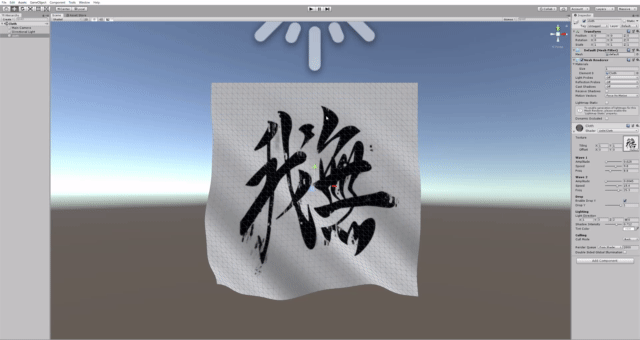

# Unity Shader Experiments

## Environment

- 2018.4.13f1 (LTS)
- Build-in Rendering Pipeline

## Cloth Shader

A cloth shader that sways in the wind.

- Derives analytical normals, so it is lightweight enough to move on mobile.
- The directional light supports.