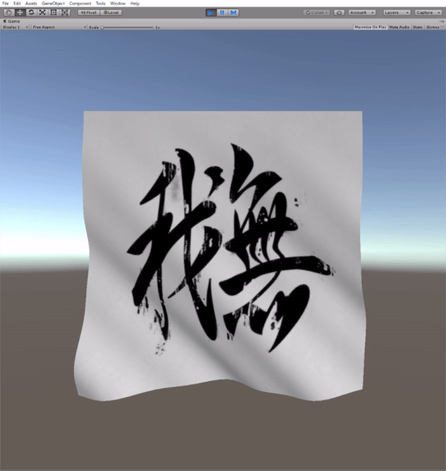

# Unity Shader Experiments

## Environment

- 2018.4.13f1 (LTS)
- Build-in Rendering Pipeline

## Cloth Shader

A cloth shader that sways in the wind.

- Derives analytical normals, so it is lightweight enough to move on mobile.
- The directional light supports.

details: [[Unity] モバイルでも動く！風に揺れる布シェーダー（解析的な法線導出） - Qiita](https://qiita.com/gam0022/items/6fad2d8df583c70d417f)

## Box Projection(Parallax-Corrected Cubemap) + Lightmap

A simple indoor shader.

- Box Projection(Parallax-Corrected Cubemap)
- Lightmap

details: [[Unity] Box Projectionで屋内シーンの反射による映り込みの品質を向上する - Qiita](https://qiita.com/gam0022/items/f20b6b55378c3ce7aa0a)
